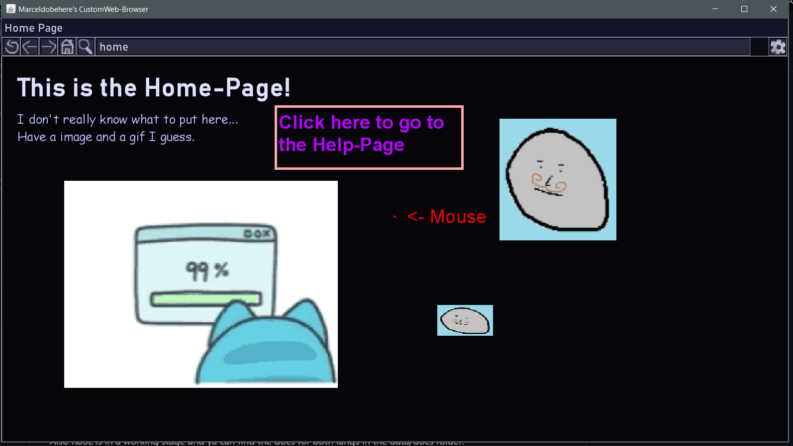
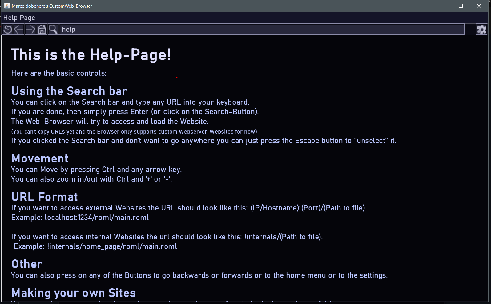

### My Custom Webbrowser and Server

I am learning da Java and so I decided to make a Webbrowser and Server which doesn't use html or css or http and stuff.
So instead theres TCP-Sockets with custom protocols, ROML, and ROSL (working on it).

It's in a somewhat ok stage.

Also RoSL is in a working stage and ya can find the docs for both langs in the data/docs folder.

